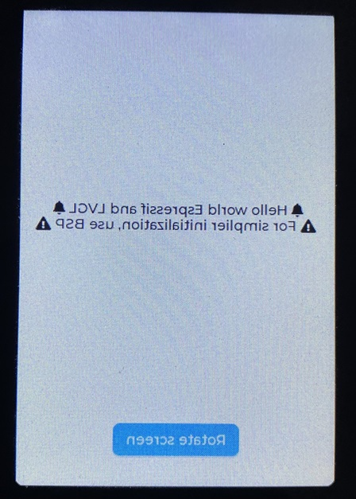

# IDF-ESP_LCD-LVGL
How to use ESP_LCD component with LVGL component from `Espressif` component repository

LCD Driver   : ESP LCD ST7796 SPI ([ESP Registry Link](https://components.espressif.com/components/espressif/esp_lcd_st7796/versions/1.2.1?language=en)) - Only v1.0.0 is supported for ESP32  
TOUCH Driver : ESP LCD Touch FT5x06 Controller ([ESP Registry Link](https://components.espressif.com/components/espressif/esp_lcd_touch_ft5x06))  
LVGL : v9.x ([ESP Registry Link](https://components.espressif.com/components/lvgl/lvgl))  
ESP_LVGL_PORT : Port from [5431be8](https://github.com/espressif/esp-bsp/commit/5431be84898f5a473442046fbdfa9cd559f3ecb7) of (esp-bsp). Need to fix Screen & touch swapped.  

